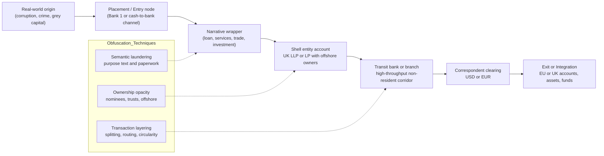
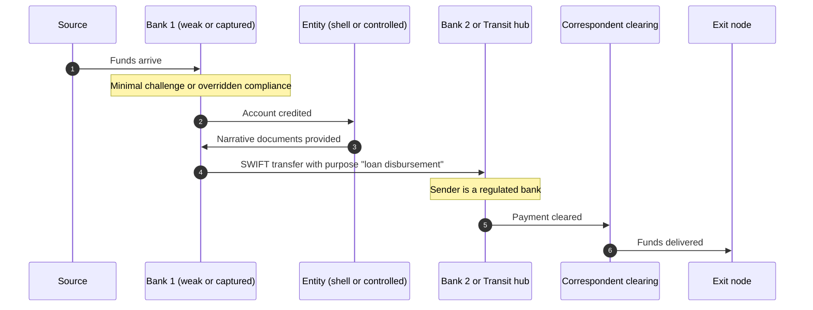
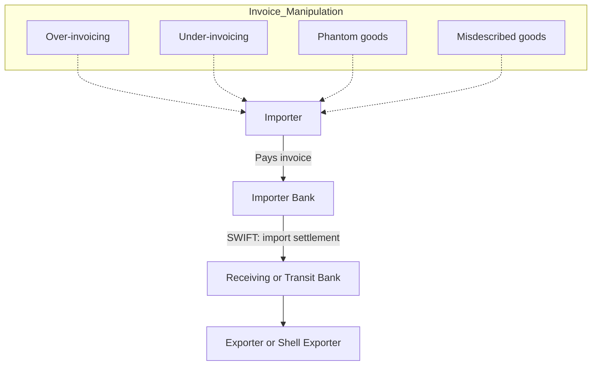

# How Illicit Money Entered and Moved Through the Banking System (Danske Estonia–Style Laundromat Typology)

This document describes common **mechanisms** by which illicit or high-risk funds were **placed**, **layered**, and **integrated** through banks, using patterns widely associated with the Danske Estonia non-resident portfolio era.  
It is **not** a “how-to”. It focuses on **forensic understanding**, red flags, and investigative framing.

---

## 1) Conceptual Overview

### The laundering problem the system solved
Illicit/high-risk money (corruption proceeds, crime proceeds, sanctions-evasion capital, tax-evasion/capital flight, etc.) faces two barriers:
1. **Placement:** converting “problem money” into bankable form
2. **Movement & legitimization:** moving funds across borders in a way that **appears normal** to banks and counterparties

### The “Laundromat corridor”
A corridor typically includes:
- **Entry bank(s)** (often weak/complicit OR structurally limited)
- **Narrative vehicles** (shell companies + paperwork)
- **Transit bank(s)** with high throughput and compliance gaps (e.g., a branch handling non-residents)
- **Correspondent banks** (USD/EUR clearing and global access)
- **Exit nodes** (EU/UK accounts, investment assets, property, luxury goods, funds)

---

## 2) Origins of Funds (Common Source Categories)

### A. Corruption and state capture
- procurement kickbacks, bribes, embezzlement, insider privatization
- public funds siphoning via contractors and intermediaries

### B. Organized crime proceeds
- fraud (including VAT carousel), smuggling, extortion, trafficking-related financial flows

### C. “Grey capital” (legal origin, illegal intent)
- capital flight, tax evasion, asset concealment, sanctions avoidance
- money may be “earned legally” but moved/hidden unlawfully

### D. Mixed flows
- portfolios often blend the above, creating camouflage via volume and variability

---

## 3) How Money Entered the Banking System “Looking Legal” (Placement Mechanisms)

### Entry Method 1: Weak / captured / complicit banks (the “first bank shield”)
**Key idea:** the *real* placement happens at Bank 1, then downstream banks treat funds as “already banked”.

How it looks:
- deposits or local transfers enter Bank 1 (in a weaker enforcement environment)
- Bank 1 accepts a **paper narrative** (“loan”, “consulting”, “trade payment”)
- funds exit Bank 1 via SWIFT as a **normal financial instrument**
- downstream bank (Bank 2) assumes upstream AML was done

**Forensic tell:** Bank 1 is repeatedly the **first regulated touchpoint** with minimal challenge.

---

### Entry Method 2: Documentary laundering (paper reality > economic reality)
**Key idea:** convert illicit funds into a recognized payment type supported by documents:
- “intercompany loan”
- “service agreement”
- “investment”
- “dividend”
- “commission”

**Forensic tell:** documents exist, but **economic plausibility** is weak (no staff, no operations, no deliverables).

---

### Entry Method 3: Trade-based money laundering (TBML)
**Key idea:** money moves as “import/export settlement” backed by invoices that are:
- over-invoiced / under-invoiced
- for phantom goods
- for misdescribed goods

Banks process trade payments because they are common and document-driven.

**Forensic tell:** trade story doesn’t match customs/shipping reality, pricing benchmarks, or counterparty capability.

---

### Entry Method 4: Cash-to-bank conversion via cash-intensive businesses
**Key idea:** dirty cash becomes “revenue” through overstated sales and partial tax payment.

**Forensic tell:** cash deposits inconsistent with location, seasonality, margins, or peer benchmarks.

---

### Entry Method 5: Legal-system laundering (judgments / debt engineering)
**Key idea:** payments become “court-ordered” or “settlement” flows.

**Forensic tell:** repetitive judgments, friendly jurisdictions, implausible debts, clustered counterparties.

---

### Entry Method 6: Professional gatekeeper channels (higher-end integration)
**Key idea:** lawyers, accountants, corporate service providers facilitate:
- company formation
- bank introductions
- narrative documentation
- escrow and client accounts

**Forensic tell:** heavy reliance on intermediaries; clients are “introduced,” opaque, and remotely managed.

---

## 4) How Money Traveled Through the System (Layering & Corridor Mechanics)

### The corridor logic (why transit hubs matter)
A transit hub/branch handling non-residents can become a **laundering accelerator** when:
- customer onboarding is formalistic
- beneficial ownership is opaque
- transaction monitoring is weak or overwhelmed
- compliance escalation is discouraged
- profitability incentives dominate risk controls

Typical movement features:
- high velocity (in/out quickly)
- repetitive patterns (templates)
- circularity (A→B→C→A)
- purpose-text reuse (“loan”, “consulting”)
- fragmented responsibility (local vs group compliance)

---

## 5) Visual: High-Level Flow (Mermaid)

