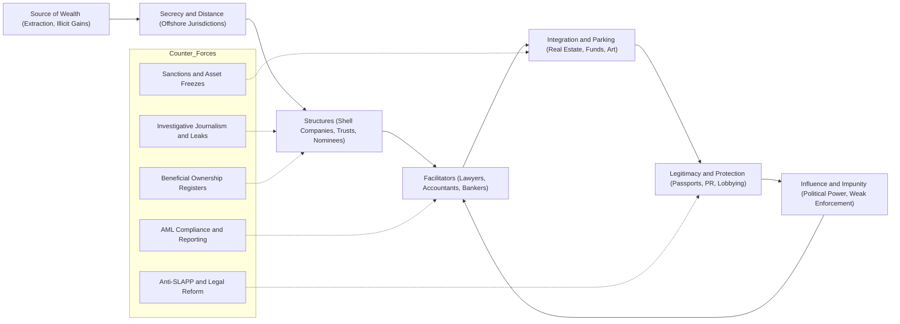

```mermaid
flowchart LR
  A["Source of Wealth (Extraction, Illicit Gains)"] --> B["Secrecy and Distance (Offshore Jurisdictions)"]
  B --> C["Structures (Shell Companies, Trusts, Nominees)"]
  C --> D["Facilitators (Lawyers, Accountants, Bankers)"]
  D --> E["Integration and Parking (Real Estate, Funds, Art)"]
  E --> F["Legitimacy and Protection (Passports, PR, Lobbying)"]
  F --> G["Influence and Impunity (Political Power, Weak Enforcement)"]
  G --> D

  subgraph Counter_Forces
    P1["Investigative Journalism and Leaks"]
    P2["AML Compliance and Reporting"]
    P3["Beneficial Ownership Registers"]
    P4["Sanctions and Asset Freezes"]
    P5["Anti-SLAPP and Legal Reform"]
  end

  P1 -.-> C
  P2 -.-> D
  P3 -.-> C
  P4 -.-> E
  P5 -.-> F

```
